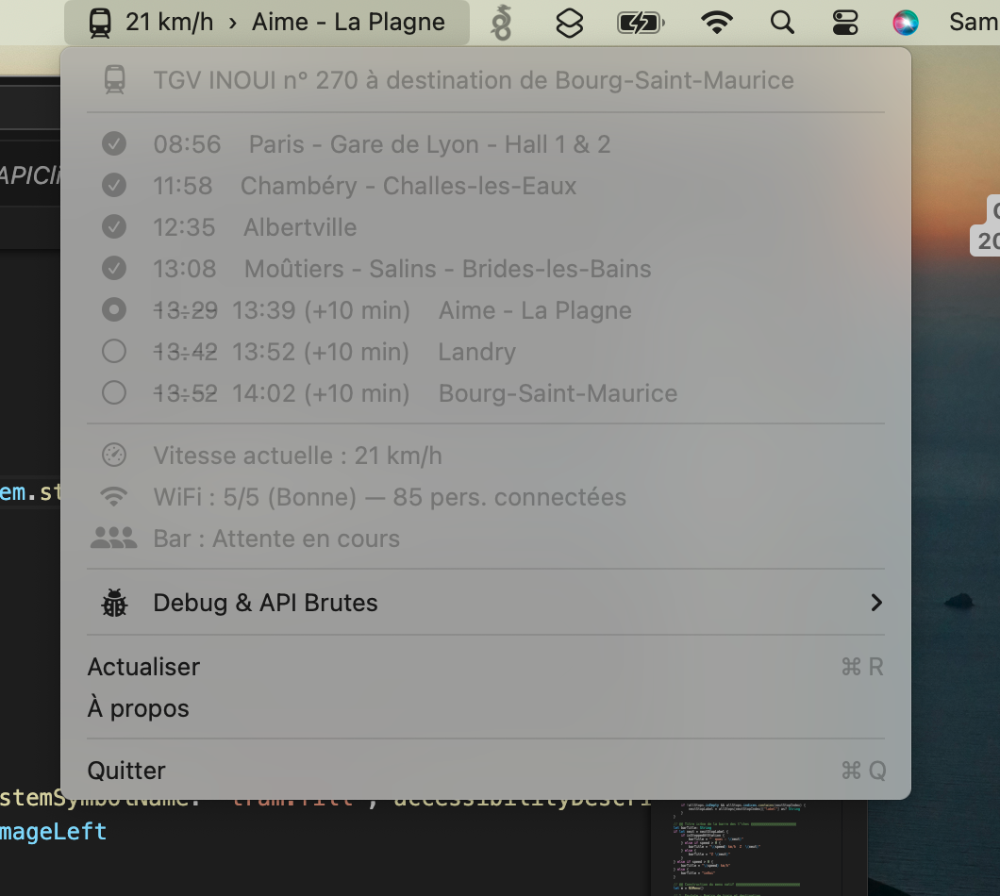
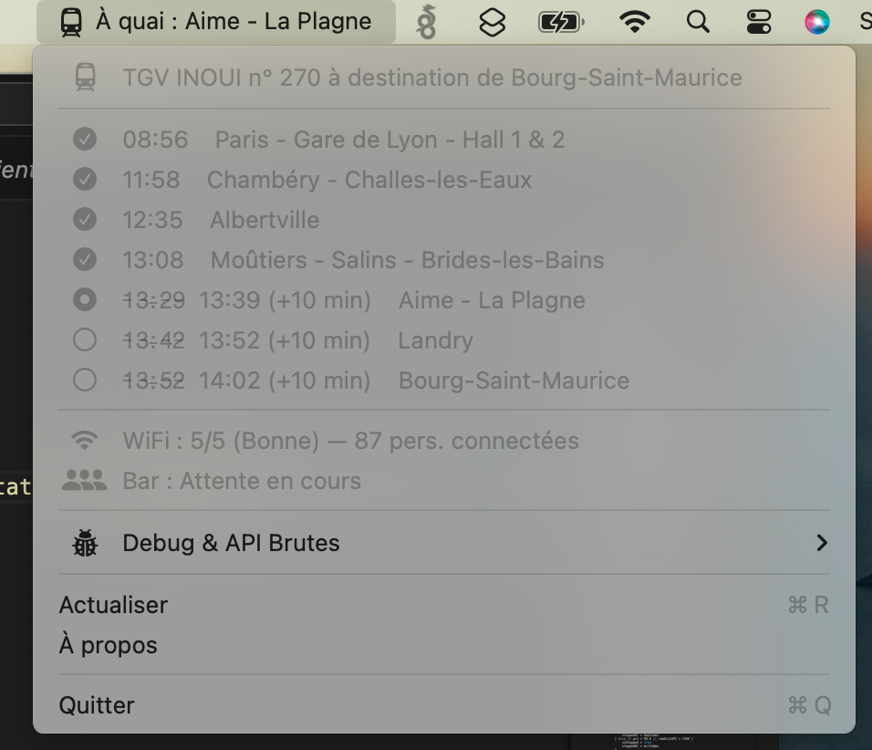

# Widget Wifi TGV 🚄

[](https://github.com/nuclearrockstone/coding-with-ai-badge)

Un widget pour la bare de menus de MacOs, permettant grâce à l'API du portail Wifi TGV Inoui de suivre les informations de votre trajet.

<p align="center">
  
  
</p>

## Fonctionnalités 🛠

- Intégration légère dans la barre des menus macOS.
- Interrogation de l'API locale du réseau WiFi du train pour obtenir des informations en temps réel sur le trajet.

## Prérequis ⚙️

- macOS
- Compilateur Swift
- Connexion au réseau WiFi d'un TGV pour que l'API réponde (affichage réduit si pas de connection au wifi).

## Compilation et Installation 🚀

Un script bash est fourni pour faciliter la compilation du projet en application macOS.

1. Rendre le script exécutable (si ce n'est pas déjà le cas) :
   ```bash
   chmod +x build.sh
   ```
2. Lancer le build :
   ```bash
   ./build.sh
   ```

Une fois terminé, vous pouvez lancer l'application via le terminal avec la commande suivante :
   ```bash
   open SNCFWifi.app
   ```
Elle apparaîtra alors directement dans votre barre des menus !

💡 **Astuce** : Pour qu'elle se lance automatiquement au démarrage de votre Mac, allez dans `Réglages Système > Général > Éléments de connexion` et ajoutez `SNCFWifi.app`.

## Développé avec l'IA 🤖

Ce projet a en parti été développé avec l'aide de l'Intelligence Artificielle.


## Mode Démo via Serveur Local

Le mode Démo n'utilise plus un générateur interne. Il lit maintenant une API locale configurable, ce qui permet de simuler des cas proches de la vraie API SNCF.

1. Lancer le serveur de démo:
   ```bash
   chmod +x start_demo_server.sh
   ./start_demo_server.sh
   ```
2. Ouvrir l'interface de configuration:
   - navigateur: `http://127.0.0.1:8787`
   - ou via le menu de l'app: `Ouvrir le panneau Démo`
3. Activer `Mode Démo (serveur local)` dans l'app.

Endpoints exposés par le serveur local:
- `GET /router/api/train/gps`
- `GET /router/api/train/progress`
- `GET /router/api/train/details`
- `GET /router/api/bar/attendance`
- `GET /router/api/connection/statistics`
